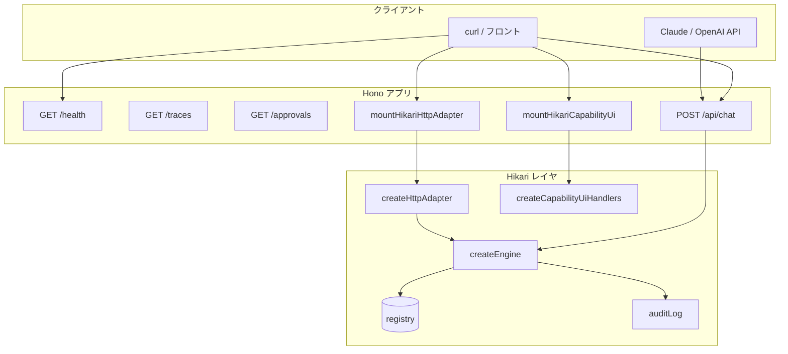

# Hono Bookstore — Hikari AI ネイティブ層の参照例

Hono で通常の HTTP API を提供しつつ、同じ書店ドメインを **Hikari ケイパビリティ**として LLM から安全に呼べる構成のサンプルです。  
ケイパビリティ定義は `examples/bookstore/` を再利用し、フレームワーク API（`mountHikariHttpAdapter`、`mountHikariCapabilityUi`、`mountHikariTraceViewer`、`mountHikariApprovals`、`createHikariExecutionOptionsMiddleware`、`resolveLlmFromEnv`）をそのまま使います。

## アーキテクチャ



| レイヤ | 役割 |
|--------|------|
| **Hono** | ルーティング、JSON バリデーション、`/health` |
| **`mountHikariHttpAdapter`** | `createHttpAdapter` を Node HTTP ブリッジでマウント |
| **`mountHikariCapabilityUi`** | レジストリから一覧・フォーム HTML を投影（`GET /capabilities` 等） |
| **`mountHikariTraceViewer`** | 監査ログから `GET /traces` HTML |
| **`mountHikariApprovals`** | 承認キュー `GET /approvals`（`devAutoApprove` 時は通常空） |
| **`createHikariExecutionOptionsMiddleware`** | `x-hikari-*` ヘッダーを Hono `Variables` に載せる |
| **`resolveLlmFromEnv`** | 環境変数から Claude / OpenAI チャットクライアントを解決 |
| **書店 registry** | `examples/bookstore` と同一（`hikari serve` とも共有可） |

`hikari serve` は Tamagui チャット UI・SSE まで含む開発サーバー。本例は **REST + 投影 UI + トレース + 承認キュー + 任意 JSON チャット** の Hono 統合デモです（購入承認は `devAutoApprove` のため即時通過。承認待ち UI は `hikari serve --approval-queue` と同様のストア API で確認可能）。

## ファイル構成

```
examples/hono-bookstore/
├── index.ts   # サーバー起動・registry 再エクスポート
├── app.ts     # Hono アプリ（本体 API を利用）
├── engine.ts  # createEngine + devAutoApprove
└── README.md
```

## 実行方法

プロジェクトルートから:

```bash
npm install
npx tsx examples/hono-bookstore/index.ts
```

デフォルトポートは `3100`（`PORT` で変更可）。

### hikari serve（Tamagui 開発 UI）との共有

Hono 例と **別プロセス**です。`index.ts` を `--entry` にすると import 時に Hono が 3100 で起動しようとして衝突します。レジストリだけ渡してください。

```bash
npx hikari serve --entry examples/bookstore/registry.ts
# 既定 LLM_PROVIDER=pi。Claude: LLM_PROVIDER=anthropic、OpenAI: LLM_PROVIDER=openai
# 既定ポート 3000（--port で変更）
```

| 起動方法 | サーバー | 既定ポート |
|----------|----------|------------|
| `npx tsx examples/hono-bookstore/index.ts` | Hono（REST + 投影 UI + traces） | 3100 |
| `npx hikari serve --entry examples/bookstore/registry.ts` | `createChatServer`（チャット + traces） | 3000 |

## curl 例

### ヘルスチェック（Hono のみ）

```bash
curl -s http://localhost:3100/health | jq
```

### ケイパビリティ投影 UI（HTML）

ブラウザまたは curl で一覧・フォームを開けます（レジストリの Zod スキーマから自動生成）。

```bash
curl -s http://localhost:3100/capabilities | head
curl -s http://localhost:3100/capabilities/list_books/form | head
```

フォームの「Execute」は `POST /api/capabilities/:name` に `application/x-www-form-urlencoded` で送信されます（JSON API と同じ `engine.execute`）。ブラウザは `Accept: text/html` のため、成功時は **HTML 結果ページ** が返ります。

`add_book` など **権限が必要なケイパビリティ** は、ブラウザではヘッダーを送れないため、先に開発用セッションで Cookie を設定してください。

```bash
# ブラウザで開く
open http://localhost:3100/capabilities/dev-session
# User ID / Permissions（例: admin,purchase）を保存 → フォームから add_book を実行
```

curl では従来どおりヘッダーで指定できます: `-H 'x-hikari-permissions: admin'`

### 監査トレース・承認キュー

```bash
curl -s http://localhost:3100/traces | head
curl -s http://localhost:3100/approvals | head
```

ケイパビリティ実行後に `/traces` を開くと監査エントリが表示されます。`/approvals` は承認ストアの待ち行列（本例のエンジンは `devAutoApprove` のため、購入以外では空のことが多い）。

### ケイパビリティ一覧（REST JSON）

```bash
curl -s http://localhost:3100/api/capabilities \
  -H 'x-hikari-user-id: user-alice' | jq
```

### ケイパビリティ実行

```bash
curl -s -X POST http://localhost:3100/api/capabilities/list_books \
  -H 'Content-Type: application/json' \
  -H 'x-hikari-user-id: user-alice' \
  -d '{}' | jq
```

購入（`purchase` 権限が必要。`write` / `financial` では `Idempotency-Key` ヘッダが必須）:

```bash
curl -s -X POST http://localhost:3100/api/capabilities/purchase_book \
  -H 'Content-Type: application/json' \
  -H 'x-hikari-user-id: user-alice' \
  -H 'x-hikari-permissions: purchase' \
  -H 'Idempotency-Key: demo-purchase-1' \
  -d '{"bookId":"1","quantity":1}' | jq
```

### チャット（任意・API キー必須）

Anthropic（Claude）:

```bash
export ANTHROPIC_API_KEY=sk-ant-...
curl -s -X POST http://localhost:3100/api/chat \
  -H 'Content-Type: application/json' \
  -H 'x-hikari-user-id: user-alice' \
  -H 'x-hikari-permissions: purchase' \
  -d '{"message":"在庫にある本を教えて"}' | jq
```

OpenAI:

```bash
export OPENAI_API_KEY=sk-...
export LLM_PROVIDER=openai
curl -s -X POST http://localhost:3100/api/chat \
  -H 'Content-Type: application/json' \
  -H 'x-hikari-user-id: user-alice' \
  -H 'x-hikari-permissions: purchase' \
  -d '{"message":"List books in stock"}' | jq
```

`resolveLlmFromEnv` の挙動は本体 [`README.md`](../../README.md) の LLM セクションを参照。

## 認証ヘッダー（開発用）

[`createHeaderExecutionOptionsResolver`](../../src/web/auth.ts) の既定ヘッダー:

| ヘッダー | 説明 |
|----------|------|
| `x-hikari-user-id` | 監査・ポリシー用のユーザー ID（未指定時 `anonymous`） |
| `x-hikari-permissions` | カンマ区切り権限（例: `purchase`, `admin`） |

本番では `createHmacJwtExecutionOptionsResolver` 等で JWT 検証し、同じ `ExecutionOptions` にマッピングしてください。

## テスト

```bash
npm test -- tests/hono-bookstore.test.ts
npm test -- tests/hono-adapter.test.ts
npm test -- tests/hono-capability-ui.test.ts
npm test -- tests/llm-provider.test.ts
```
